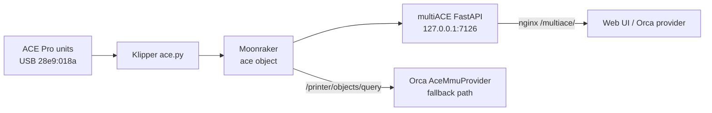

# multiACE Firmware Integration

Design notes for integrating [multiACE](https://github.com/decay71/multiACE)
(multi–Anycubic-ACE-Pro support for the Snapmaker U1) into this firmware as a
maintained app overlay, instead of the upstream "SSH in and run
`install_multiace.sh`" flow. The overlay is **additive** — it never replaces
stock Klipper files.

This document is **design/research only** — it describes what the integration
looks like and the decisions behind it. No code is shipped yet.

## Current state — is it already integrated?

**No.** As of this writing there is no ACE / multiACE overlay in this
repository. Verified by searching the tree for `multiace`, `ACE_SWAP`,
`ace_device_count`, and the `ACEA__`/`ACEB__` macro prefixes — the only matches
are in the sibling Orca slicer docs, none under `overlays/`.

Note the naming overlap: multiACE's own README lists "PAXX Firmware Compatible /
Installer" and "Integrated PAXX Firmware". That is **multiACE's installer
detecting PAXX firmware** (for display mirroring), not an overlay living in this
repo. The integration described here is the missing other half: shipping
multiACE *from* the firmware build.

## What multiACE installs on the printer

From the upstream repo layout (`multiace/` folder) and
`install_multiace.sh` / `uninstall_multiace.sh`, the printer-side footprint is:

| Upstream path | Installed to | Purpose |
|---------------|--------------|---------|
| `klipper/extras/ace.py` | `/home/lava/klipper/klippy/extras/` | ACE serial engine, exposes the `ace` Klipper object |
| `klipper/extras/filament_feed_ace.py` | `…/klippy/extras/` | Feed-assist replacement |
| `klipper/extras/filament_switch_sensor_ace.py` | `…/klippy/extras/` | Sensor handling replacement |
| `klipper/kinematics/extruder_ace.py` | `…/klippy/kinematics/` | Extruder replacement |
| `config/extended/ace.cfg` | `/home/lava/printer_data/config/extended/` | `[ace]` config + `ACEx__` Fluidd macros |
| `config/extended/multiace/ace_vars.cfg` | `…/config/extended/multiace/` | Persisted runtime vars |
| `config/extended/multiace/ace_mode_switch.sh` | `…/config/extended/multiace/` | Swaps stock↔ACE Klipper files (Normal/Multi mode) |
| `web/` (backend + frontend) | FastAPI on `127.0.0.1:7126` + nginx `/multiace/` | Optional Web UI / preflight (`--install-web`) |
| `tools/post_process_virtual_toolheads.py` | (client PC or on-device) | Slicer post-processor |

Key facts that drive the design:

- **multiACE overwrites live Klipper files.** Upstream replaces stock
  `filament_feed.py` / `extruder.py` / `filament_switch_sensor.py` under
  `/home/lava/klipper/klippy/…`, backing the originals up as `*_pre_multiace.py`,
  and swaps them at runtime via `ace_mode_switch.sh`. **This integration does
  not do that** — see the additive approach in [Overlay design](#overlay-design).
- **It hooks Klipper config** by adding an `ace.cfg` include to `printer.cfg`.
  This firmware already has an "extended includes" mechanism
  (`extended/klipper/*.cfg`, see [Klipper Includes](../klipper_includes.md)) that
  is the natural, non-destructive way to carry that include.
- **The Web UI is optional.** Inventory/state is ultimately the Klipper `ace`
  object exposed over Moonraker; the FastAPI service is a normalizing/reshaping
  layer plus a control panel (see the Orca-side
  `docs/ace-mmu/02-multiace-printer-api.md` in the slicer repo).
- **Root + SSH is required** by the upstream installer; a firmware overlay does
  the same file placement at *build time* instead, which is exactly what the
  overlay system is for.
- **Firmware updates clobber the upstream install** — because it edits files
  Snapmaker ships, upstream tells users to uninstall before flashing. Building it
  into the image as an *additive* overlay removes that failure mode entirely (the
  ACE modules are separate files that are part of the image; stock files are
  never touched).

## Integration path — maintained app overlay

This integration ships as a maintained app overlay under
`overlays/firmware-extended/NN-app-multiace/`, alongside the other `NN-app-*`
overlays (openrfid, filament-ui, …), gated behind a Firmware Config toggle and —
for the heavy Web UI — the on-demand `*-pkg` download pattern from
[Third-Party Integrations](third_party.md). It is enabled per build/device, off
by default, and reaches the printer as part of the firmware image rather than a
separate SSH install.

## Overlay design

A single numbered overlay, e.g. `NN-app-multiace/`, composed of the standard
`pre-scripts/ → patches/ → root/ → scripts/` stages
([Overlay Structure](../development.md#overlay-structure)).

### 1. Klipper Python modules — `root/` (additive, no stock-file replacement)

Ship the four multiACE Python modules as plain root files (new files, so `root/`
not `patches/`):

```text
root/home/lava/klipper/klippy/extras/ace.py
root/home/lava/klipper/klippy/extras/filament_feed_ace.py
root/home/lava/klipper/klippy/extras/filament_switch_sensor_ace.py
root/home/lava/klipper/klippy/kinematics/extruder_ace.py
```

**Additive route.** Upstream swaps stock
`filament_feed.py` / `extruder.py` / `filament_switch_sensor.py` at runtime via
`ace_mode_switch.sh`. This overlay does **not** do that. Instead it ships the ACE
variants under distinct `*_ace.py` names (as above) and selects them from config,
leaving the stock Klipper files untouched. Benefits:

- **"Normal Mode" is free** — the stock files are always present, so falling back
  to stock feeder behaviour (needed for TPU/TPE the ACE can't handle) is just a
  matter of which modules `ace.cfg` loads; nothing is swapped on disk.
- **No conflict with the build's own Klipper patches**
  (`overlays/firmware-extended/11-patch-klipper`) — stock filenames keep their
  stock, already-patched contents.
- **No "half-stock/half-ACE" failure state** — there is no runtime file swap that
  can partially fail.

The one thing to confirm on hardware (see open questions): that multiACE can be
driven purely by which module `ace.cfg` loads, without physically overwriting the
stock filenames. `ace_mode_switch.sh` is **not** shipped.

### 2. Klipper config include — `root/`

Carry `ace.cfg` through the existing extended-includes directory rather than
patching `printer.cfg`:

```text
root/oem/printer_data/config/extended/klipper/ace.cfg
root/oem/printer_data/config/extended/multiace/ace_vars.cfg
```

Because `extended/klipper/*.cfg` is auto-included
([Klipper Includes](../klipper_includes.md)), no `printer.cfg` patch is needed.
`ace.cfg` must reference the additive `*_ace.py` modules (§1) rather than the
stock filenames. `ace_device_count` defaults to `1`, so a single-ACE user needs
no edits; multi-ACE users bump it in Fluidd/Mainsail.

### 3. Web UI + nginx — `root/` (+ optional `*-pkg`)

The FastAPI service binds `127.0.0.1:7126`; expose it through the existing
nginx `fluidd.d` include hook (added by `overlays/common/04-nginx-fluidd.d`,
which appends `include /etc/nginx/fluidd.d/*.conf;`). So the whole nginx wiring
is one drop-in file — no nginx patch:

```text
root/etc/nginx/fluidd.d/multiace.conf     # location /multiace/ -> 127.0.0.1:7126
root/etc/init.d/S98multiace-web           # start the FastAPI service
```

The backend is Python/JS and non-trivial in size; per
[Third-Party Integrations](third_party.md) it is a good candidate for the
`*-pkg` on-demand pattern (pinned version + SHA256, fetched only when the user
enables it) rather than being baked into every image. The Klipper engine (small,
core to the feature) can ship in-image; the Web UI (large, optional) can be
`*-pkg`.

### 4. Firmware Config toggle — `root/`

Add a `firmware-config` function YAML so the feature is switchable from the
on-device Settings UI, mirroring `15_settings_openrfid.yaml`:

```text
root/usr/local/share/firmware-config/functions/NN_settings_multiace.yaml
```

It would: write the component flag via `extended-config.py`, drop `ace.cfg`
into `extended/klipper/` if missing, (optionally) trigger the `*-pkg` web
download, and restart Klipper + the web service. Because the overlay is additive
(§1), the Normal/Multi choice is a config selection (which modules `ace.cfg`
loads), not an on-disk file swap — expose it here so users can fall back to stock
behaviour (needed for TPU/TPE that the ACE can't handle).

### 5. Build-time fetch — `pre-scripts/`

If the modules are pulled from the upstream repo at build time (rather than
vendored), use the repo's `cache_git.sh` helper against a pinned SHA, exactly as
`64-app-openrfid/pre-scripts/01-install-openrfid.sh` does. Pin a specific
multiACE release tag (e.g. a `v0.9x` tag) and record the SHA256 so builds are
reproducible.

## Data / control flow



The numbering identity the slicer relies on is unchanged: multiACE virtual
tool `T = ace*4 + slot`, which is exactly Orca's `tray_index = ams_id*4 +
tray_id`. See the slicer repo's `docs/ace-mmu/` set for the consumer side.

## Relationship to the Orca slicer provider

These are the two halves of the same feature and are independent:

- **This doc (firmware):** makes the ACE inventory + control *exist* on the
  printer as an in-image feature (Klipper `ace` object, macros, optional Web UI).
- **`docs/ace-mmu/` (slicer):** the `AceMmuProvider` that *reads* that state
  (via `/multiace/api/state` or Moonraker directly) and surfaces it in Orca's
  AMS UI.

Integrating multiACE into the firmware makes the slicer provider's
Moonraker-direct fallback more attractive: if the `ace` object is guaranteed
present in-image, the provider can query `/printer/objects/query?ace` without
depending on a user having run the standalone Web UI installer.

## Open questions / risks

1. **Additive load path** (§1) — confirm on hardware that multiACE runs purely
   from the `*_ace.py` modules selected by `ace.cfg`, with the stock
   `filament_feed.py` / `extruder.py` / `filament_switch_sensor.py` left intact
   and `ace_mode_switch.sh` not shipped. This is the gating assumption of the
   additive route.
2. **Interaction with `11-patch-klipper`** — the maintained build already
   patches Klipper; confirm the additive ACE modules don't collide with those
   patches (they shouldn't, since stock filenames are untouched).
3. **Interaction with OpenRFID / rfid-spools** — **resolved; they coexist
   without conflict.** The two systems use entirely different hardware:

   | | ACE (V1 / V2) RFID | OpenRFID |
   |---|---|---|
   | Reader hardware | ACE-internal NFC reader, one per spool slot | U1 toolhead NFC readers (GPIO) |
   | Tag type | Anycubic NTAG215, proprietary format (brand/type/color/SKU) | TigerTag on NTAG213/215 |
   | Host interface | USB serial (`ace.py` USB protocol) | GPIO/Klipper (`filament_detect`) |
   | Klipper object | `ace.slots[n].rfid` / `.brand` / `.type` | `filament_detect.info[channel]` |
   | Purpose | Identifies filament inside an ACE spool slot | Identifies spool physically present at the toolhead |

   **They are not the same tag format.** The Anycubic NTAG215 tags read by the
   ACE are encoded in Anycubic's proprietary layout (reverse-engineered by
   [AnycubicNFCScript](https://github.com/EnderPy/AnycubicNFCScript) and
   [ACEResearch](https://github.com/printers-for-people/ACEResearch)).
   OpenRFID reads TigerTag-formatted NTAG213/215 tags through a completely
   separate reader path and has no knowledge of ACE hardware.

   **multiACE handles the `filament_detect` interaction explicitly.** In
   `ace.py`, multiACE hooks the `filament_detect` update callback and
   suppresses RFID-clear events when it is managing a channel (mode = multi /
   head). Concretely:
   - **Normal mode** (ACE disabled): `filament_detect` callbacks flow
     unchanged — OpenRFID writes toolhead spool identity as usual.
   - **Multi/Head mode** (ACE managing channels): multiACE intercepts clears
     and suppresses them so ACE spool data is not overwritten. It still
     propagates valid filament identity (brand/type/color) from ACE RFID data.

   A user running both OpenRFID and multiACE simultaneously should expect ACE
   spool data to win for the channels multiACE controls; OpenRFID's toolhead tag
   reads still fire but their `CARD_UID` / `OFFICIAL` flags land normally.
   The combination is not tested but the code paths are structurally separate.
4. **Web UI size / licensing** — GPL-3.0 (compatible with this repo's GPL-3.0).
   Decide in-image vs `*-pkg`.
5. **Upstream tracking** — multiACE is beta and moves fast (17 releases). Pin a
   tag and document the bump procedure; do not track `main`.
6. **ACE 2 Pro firmware requirement** — ACE 2 units need ACE firmware 1.1.31;
   out of scope for the printer firmware but worth a doc note.

## RFID subsystem — ACE vs OpenRFID

This section records the findings from researching ACE 2 Pro RFID and
its relationship to OpenRFID.

### How the ACE reads spool tags

Both ACE Pro (V1) and ACE 2 Pro (V2) contain an **internal NFC reader per
spool slot**. When a spool is inserted the ACE reads an **NTAG215** tag
affixed to the spool and makes the data available to the host over USB.

The tag format is Anycubic-proprietary (reverse-engineered by the
[AnycubicNFCScript](https://github.com/EnderPy/AnycubicNFCScript) project),
carrying brand, material type, color (RGB), and SKU. Custom tags can be
written with NFC Tools Pro + the script.

#### Protocol differences between V1 and V2

| | ACE Pro V1 | ACE 2 Pro V2 |
|---|---|---|
| Transport | USB CDC, text JSON framing (PROTOCOL.md) | USB CDC, binary protobuf at 230400 baud |
| RFID commands | `enable_rfid`, `disable_rfid`, `get_filament_info` → `rfid:0–3` | `filament_identify` (cmd 68), `rfid_test` (cmd 69), `set_rfid_enable` (cmd 14), `get_filament_info` (cmd 13) |
| Empty slot status | `"empty1"` | `"empty"` |
| Connector | 2×3 Molex | 2×2 Molex |
| Min firmware for V2 | — | ACE firmware 1.1.31 |

The RFID status codes from `get_filament_info` / `get_status` are
`0` = not found, `1` = failed to identify, `2` = identified,
`3` = identifying.

### How OpenRFID works

OpenRFID reads **toolhead-mounted NFC readers** (GPIO-connected, one per
toolhead on the U1). The tags it reads are **TigerTag**-formatted NTAG213/215
tags physically attached to spool rolls. It writes the decoded filament
identity to `filament_detect.info[channel]` via the Klipper API. It has no
connection to ACE hardware at all.

### Compatibility verdict

**Not compatible and not competing** — completely different hardware stacks.
They can coexist on the same printer because:

- The ACE readers only see tags *inside the ACE spool slots* (Anycubic format).
- The toolhead readers only see tags *on spools at the toolhead* (TigerTag format).
- Neither reader can read the other's tags (different payload layout).
- `ace.py` explicitly manages the `filament_detect` callback to prevent
  its clear-on-empty events from clobbering data OpenRFID wrote (see
  open question #3 above).

## References

- Upstream: <https://github.com/decay71/multiACE> (`multiace/` folder,
  `install_multiace.sh`)
- Slicer-side consumer: `docs/ace-mmu/` in the Snapmaker Orca repo
  (esp. `02-multiace-printer-api.md`)
- Firmware patterns:
  [Third-Party Integrations](third_party.md),
  [Klipper Includes](../klipper_includes.md),
  [Building from Source](../development.md)
- Closest existing analog overlay: `overlays/firmware-extended/64-app-openrfid/`
